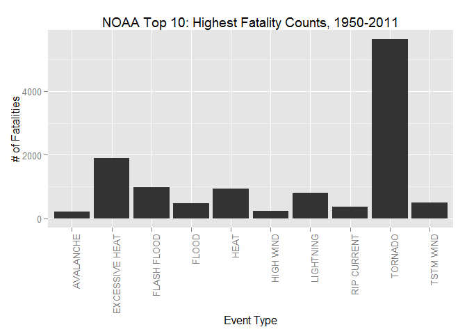
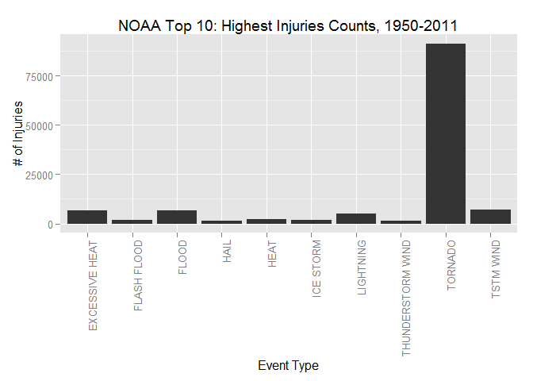
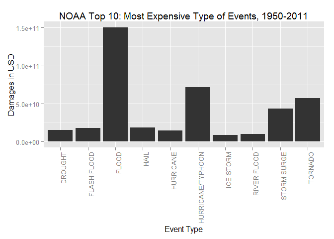

# Economic and health impact of storms and sever weather

## Synopsis

Storms and Severe weather has serious economic and health impacts. Many severe events can result in fatalities, injuries, and property damage, and preventing such outcomes to the extent possible is a key concern. The purpose of this assignment was to determine which severe weather types have the greatest economic and health effects. Economic effects were operationalized as the degree of property and crop damage. Health effects were operationalized as number of fatalities and injuries.The data is composed by 37 variables, 7 of which seemed relevent to the analysis. Data will be cleansed, re-ordered and analyised to answer the below questions.

1. Which types of events are most harmful with respect to population health?
2. Which types of events have the greatest economic consequences 

I analyzed data taken from the U.S. National Oceanic and Atmospheric Administration's (NOAA) storm database. The data was far from tidy and needed some initial preprocessing prior to the analysis.

The report begins with initial data processing followed by a subsequent analysis with the most important results plotted (no more than three plots were permitted for this assignment). I end the report with results and briefly discuss their implications.

In short, results revealed that hurricanes have the most significant economic impact, while tornadoes are the most deadly.


## Data Processing

Loading and preprocessing the data
 

```r
  if (!file.exists("storm.csv")) 
  {
      library(R.utils)
      # unzip file
      bunzip2("repdata_data_StormData.csv.bz2", "storm.csv", remove = FALSE)
  }
  
   # Load the storm.csv file
   storm <- read.csv("storm.csv")
```

Extracting the data contain weather event, health and economic impact data
exploring the data contents


```r
   head(storm)
```

```
##   STATE__           BGN_DATE BGN_TIME TIME_ZONE COUNTY COUNTYNAME STATE
## 1       1  4/18/1950 0:00:00     0130       CST     97     MOBILE    AL
## 2       1  4/18/1950 0:00:00     0145       CST      3    BALDWIN    AL
## 3       1  2/20/1951 0:00:00     1600       CST     57    FAYETTE    AL
## 4       1   6/8/1951 0:00:00     0900       CST     89    MADISON    AL
## 5       1 11/15/1951 0:00:00     1500       CST     43    CULLMAN    AL
## 6       1 11/15/1951 0:00:00     2000       CST     77 LAUDERDALE    AL
##    EVTYPE BGN_RANGE BGN_AZI BGN_LOCATI END_DATE END_TIME COUNTY_END
## 1 TORNADO         0                                               0
## 2 TORNADO         0                                               0
## 3 TORNADO         0                                               0
## 4 TORNADO         0                                               0
## 5 TORNADO         0                                               0
## 6 TORNADO         0                                               0
##   COUNTYENDN END_RANGE END_AZI END_LOCATI LENGTH WIDTH F MAG FATALITIES
## 1         NA         0                      14.0   100 3   0          0
## 2         NA         0                       2.0   150 2   0          0
## 3         NA         0                       0.1   123 2   0          0
## 4         NA         0                       0.0   100 2   0          0
## 5         NA         0                       0.0   150 2   0          0
## 6         NA         0                       1.5   177 2   0          0
##   INJURIES PROPDMG PROPDMGEXP CROPDMG CROPDMGEXP WFO STATEOFFIC ZONENAMES
## 1       15    25.0          K       0                                    
## 2        0     2.5          K       0                                    
## 3        2    25.0          K       0                                    
## 4        2     2.5          K       0                                    
## 5        2     2.5          K       0                                    
## 6        6     2.5          K       0                                    
##   LATITUDE LONGITUDE LATITUDE_E LONGITUDE_ REMARKS REFNUM
## 1     3040      8812       3051       8806              1
## 2     3042      8755          0          0              2
## 3     3340      8742          0          0              3
## 4     3458      8626          0          0              4
## 5     3412      8642          0          0              5
## 6     3450      8748          0          0              6
```

subset the data to health and economic impact analysis against weather
event, there are 7 variables related to these questions:


```r
   storm <- data.frame(storm$EVTYPE, storm$FATALITIES, storm$INJURIES, storm$PROPDMG, storm$PROPDMGEXP, storm$CROPDMG, storm$CROPDMGEXP)
```

Data frame with just these 7 variables.

EVTYPE as a measure of event type

FATALITIES as a measure of harm to human health

INJURIES as a measure of hram to human health

PROPDMG as a measure of property damage and hence economic damanage 

PROPDMGEXP as a measure of magnitude of property damage   

CROPDMG as a measure of crop damage and hence a economic damage in USD

CROPDMGEXP as a measure of magnitude of crop damage  


Preparing the property damage data.

Exploring the property exponent


```r
   summary(storm)
```

```
##             storm.EVTYPE    storm.FATALITIES   storm.INJURIES     
##  HAIL             :288661   Min.   :  0.0000   Min.   :   0.0000  
##  TSTM WIND        :219940   1st Qu.:  0.0000   1st Qu.:   0.0000  
##  THUNDERSTORM WIND: 82563   Median :  0.0000   Median :   0.0000  
##  TORNADO          : 60652   Mean   :  0.0168   Mean   :   0.1557  
##  FLASH FLOOD      : 54277   3rd Qu.:  0.0000   3rd Qu.:   0.0000  
##  FLOOD            : 25326   Max.   :583.0000   Max.   :1700.0000  
##  (Other)          :170878                                         
##  storm.PROPDMG     storm.PROPDMGEXP storm.CROPDMG     storm.CROPDMGEXP
##  Min.   :   0.00          :465934   Min.   :  0.000          :618413  
##  1st Qu.:   0.00   K      :424665   1st Qu.:  0.000   K      :281832  
##  Median :   0.00   M      : 11330   Median :  0.000   M      :  1994  
##  Mean   :  12.06   0      :   216   Mean   :  1.527   k      :    21  
##  3rd Qu.:   0.50   B      :    40   3rd Qu.:  0.000   0      :    19  
##  Max.   :5000.00   5      :    28   Max.   :990.000   B      :     9  
##                    (Other):    84                     (Other):     9
```

```r
   # replace missing storm with 0's
   storm$storm.FATALITIES[(storm$storm.FATALITIES == "")] <- 0
   storm$storm.INJURIES[(storm$storm.INJURIES == "")] <- 0
   storm$storm.PROPDMG[(storm$storm.PROPDMG == "")] <- 0
   storm$storm.CROPDMG[(storm$storm.CROPDMG == "")] <- 0

   storm$storm.PROPDMGEXP <- as.character(storm$storm.PROPDMGEXP)
   storm$storm.CROPDMGEXP <- as.character(storm$storm.CROPDMGEXP)

   # use a uniform numbers
   storm$storm.PROPDMGEXP[(storm$storm.PROPDMGEXP == "")] <- 0
   storm$storm.PROPDMGEXP[(storm$storm.PROPDMGEXP == "+") | (storm$storm.PROPDMGEXP == "-") | (storm$storm.PROPDMGEXP == "?")] <- 1
   storm$storm.PROPDMGEXP[(storm$storm.PROPDMGEXP == "h") | (storm$storm.PROPDMGEXP == "H")] <- 2
   storm$storm.PROPDMGEXP[(storm$storm.PROPDMGEXP == "k") | (storm$storm.PROPDMGEXP == "K")] <- 3
   storm$storm.PROPDMGEXP[(storm$storm.PROPDMGEXP == "m") | (storm$storm.PROPDMGEXP == "M")] <- 6
   storm$storm.PROPDMGEXP[(storm$storm.PROPDMGEXP == "B")] <- 9
   storm$storm.CROPDMGEXP[(storm$storm.CROPDMGEXP == "")] <- 0
   storm$storm.CROPDMGEXP[(storm$storm.CROPDMGEXP == "+") | (storm$storm.CROPDMGEXP == "-") | (storm$storm.CROPDMGEXP == "?")] <- 1
   storm$storm.CROPDMGEXP[(storm$storm.CROPDMGEXP == "h") | (storm$storm.CROPDMGEXP == "H")] <- 2
   storm$storm.CROPDMGEXP[(storm$storm.CROPDMGEXP == "k") | (storm$storm.CROPDMGEXP == "K")] <- 3
   storm$storm.CROPDMGEXP[(storm$storm.CROPDMGEXP == "m") | (storm$storm.CROPDMGEXP == "M")] <- 6
   storm$storm.CROPDMGEXP[(storm$storm.CROPDMGEXP == "B")] <- 9

   # convert to integer
   storm$storm.PROPDMGEXP <- as.integer(storm$storm.PROPDMGEXP)
   storm$storm.CROPDMGEXP <- as.integer(storm$storm.CROPDMGEXP)

   # Total Damage for each event
   totalDamageUSD <- storm$storm.PROPDMG * 10^storm$storm.PROPDMGEXP + storm$storm.CROPDMG * 10^storm$storm.CROPDMGEXP
   storm <- cbind(storm, totalDamageUSD)
```

Aggregate the data in order to prepare it for the results.
Data will be aggregated (SUM) on Event Type level, the TOP 10 events will be then indentified


```r
   # Subsetting the data, keeping on the numeric values and the event type column
   storm<-storm[,c(1,2,3,8)]

   # Aggregate the data
   aggstorm<-aggregate(. ~ storm.EVTYPE,data = storm,FUN=sum)

   # Matrix containing only the Top 10 events are calculated
   Fatalities<-head(aggstorm[order(aggstorm$storm.FATALITIES,decreasing=T),],10)
   Injuries<-head(aggstorm[order(aggstorm$storm.INJURIES,decreasing=T),],10)
   Damages<-head(aggstorm[order(aggstorm$totalDamageUSD,decreasing=T),],10)
```

## Results

1.Across the United States, which types of events (as indicated in the EVTYPE variable) are most harmful with respect to population health?

The answer can give by plotting the TOP 10 events which have caused the highest number of Fatalities


```r
   library("ggplot2")
```

```
## Warning: package 'ggplot2' was built under R version 3.1.2
```

```r
   Fatalities<-head(aggstorm[order(aggstorm$storm.FATALITIES,decreasing=T),],10)
   ggplot(data = Fatalities, aes(x = Fatalities$storm.EVTYPE, y = Fatalities$storm.FATALITIES)) + geom_bar(stat = "identity") + 
   theme(axis.text.x = element_text(angle = 90, hjust = 1)) + xlab("Event Type") + 
   ylab("# of Fatalities") + ggtitle("NOAA Top 10: Highest Fatality Counts, 1950-2011")
```

 

```r
   Injuries<-head(aggstorm[order(aggstorm$storm.INJURIES,decreasing=T),],10)
   ggplot(data = Injuries, aes(x = Injuries$storm.EVTYPE, y = Injuries$storm.INJURIES)) + geom_bar(stat = "identity") +  theme(axis.text.x = element_text(angle = 90, hjust = 1)) + xlab("Event Type") +  ylab("# of Injuries") + ggtitle("NOAA Top 10: Highest Injuries Counts, 1950-2011")
```

 

In both cases Tornados are the most harmful events to the population


```r
   Fatalities[Fatalities$storm.EVTYPE=="TORNADO",c(1,2,3)]
```

```
##     storm.EVTYPE storm.FATALITIES storm.INJURIES
## 834      TORNADO             5633          91346
```

2.Across the United States, which types of events have the greatest economic consequences?


```r
   ggplot(data = Damages, aes(x = Damages$storm.EVTYPE, y = Damages$totalDamageUSD)) + geom_bar(stat = "identity") + 
   theme(axis.text.x = element_text(angle = 90, hjust = 1)) + xlab("Event Type") + 
   ylab("Damages in USD") + ggtitle("NOAA Top 10: Most Expensive Type of Events, 1950-2011")
```

 

 FLOOD has caused about 150 Billions of damages in USD
 

```r
   Fatalities[Fatalities$storm.EVTYPE=="FLOOD",c(1,4)]
```

```
##     storm.EVTYPE totalDamageUSD
## 170        FLOOD   150319678257
```

## Summary
 
 Conclusion of the data analysis is that Tornadoes are most harmful to popuulation health and floods have the greatest economic consequences.
